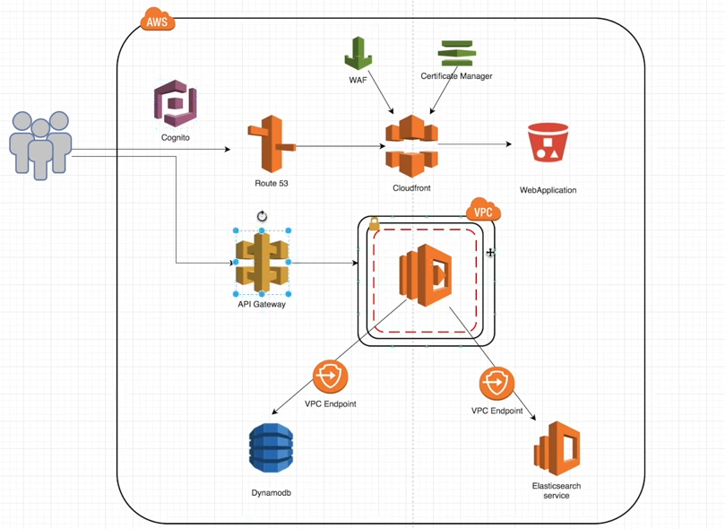

# Ecommerce Webapp

### Architecture Diagram

### Frontend Setup

1. Checkout the docs `https://docs.amplify.aws/start/q/integration/angular/`
2. Install Amplify CLI globally using `npm install -g @aws-amplify/cli` and check the version using `amplify -v`
3. Configure amplify using `amplify configure`
4. Add below npm dependencies

~~~text
npm install --save aws-amplify @aws-amplify/ui-angular
~~~

5. Use `amplify init` to setup a backend project
6. Use `amplify hosting add` to add a Cloudfront distribution to serve the frontend
7. Use `amplify publish` to push changes to AWS
8. To delete all the resource use `amplify delete`